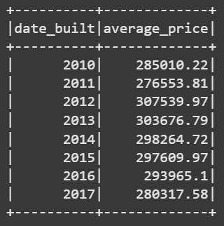

# Module 22 Challenge: Home_Sales

### Overview
This challenge focused on using SparkSQL to determine key metrics about home sales data, then using Spark to create temporary views, partition the data, cache and uncache a temporary table, and verify that the table has been uncached.

### Files and Functions
1. Jupyter notebook, "Home_Sales_colab.ipynb"
    * Home sales datafile located in AWS S3 bucket, "https://2u-data-curriculum-team.s3.amazonaws.com/dataviz-classroom/v1.2/22-big-data/home_sales_revised.csv"
    * Spark, PySpark SQL, Java
2. Image files showing the results of the analysis questions.    

### Analysis
1. Answer the following questions using SparkSQL:
    * What is the average price for a four-bedroom house sold for each year? 

    

    * What is the average price of a home for each year the home was built, that has three bedrooms and three bathrooms? 
    
    

    * What is the average price of a home for each year the home was built, that has three bedrooms, three bathrooms, two floors, and is greater than or equal to 2,000 square feet? 
    
    

    * What is the average price of a home per "view" rating having an average home price greater than or equal to $350,000? 
    
    

2. Compare run time for cached, uncached and partitioned data for the last query above.

    * Uncached run time: --- 1.02 seconds ---

    * Using cached data, run time improved by about 33%: Cached run time: --- 0.69 seconds ---

    * Using partitioned data, the above query run time took nearly 50% longer than the uncached data: Parquet run time: --- 1.51 seconds ---
